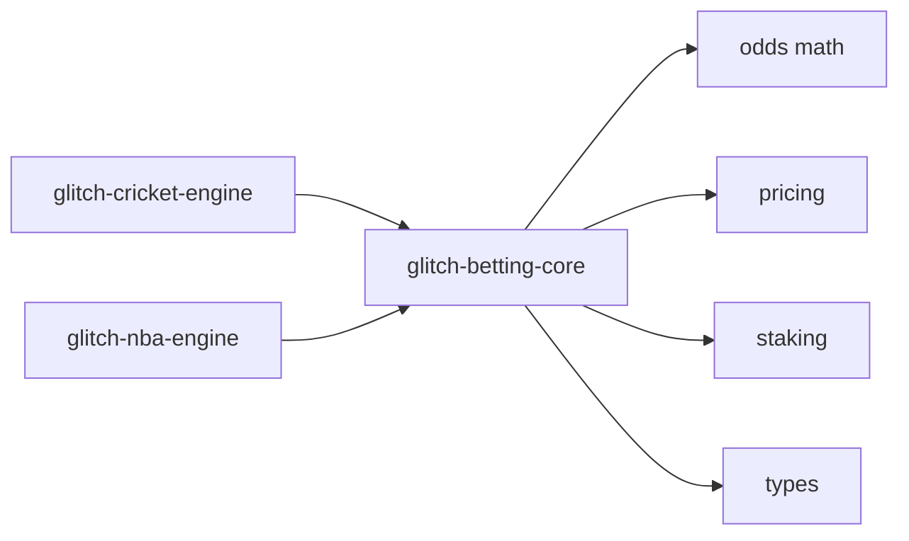

# Glitch Betting Core


Shared math, pricing, and infrastructure primitives for the Glitch sports engine family.

This repo is the common layer intended to sit underneath sport-specific systems like `glitch-cricket-engine` and `glitch-nba-engine`. It holds the reusable parts that should not be copied and drift across repos: implied-probability math, edge calculations, staking helpers, core types, and eventually shared reporting or messaging helpers.

## Why This Repo Exists

Branches are the wrong boundary for separating sports. Cricket and NBA need their own product identity, docs, and execution logic. But they also share a real core:

- odds conversion math
- probability and vig handling
- edge calculations
- stake sizing logic
- common result types
- later, shared reporting and alert utilities

Glitch Betting Core exists so those shared pieces can live in one place and be imported cleanly into each sport-specific repo.

## What Belongs Here

- bookmaker odds conversion and normalization helpers
- implied probability and no-vig math
- expected value and edge calculations
- bankroll / stake sizing primitives
- common dataclasses and typed result objects
- pure, reusable utilities with no sport-specific assumptions

## What Does Not Belong Here

- cricket-specific innings logic
- NBA-specific mapping logic
- provider-specific runtime glue that only one sport uses
- league-specific strategy rules
- environment secrets, models, state files, or runtime databases

## Architecture



## Package Layout

```text
src/glitch_betting_core/
  odds.py        odds conversions and probability helpers
  pricing.py     no-vig and edge calculations
  staking.py     bankroll and Kelly-style helpers
  types.py       shared dataclasses for prices and decisions
  __init__.py    package exports

tests/
  test_odds.py
  test_pricing.py
  test_staking.py

docs/
  architecture.md
  roadmap.md
  adoption.md
```

## Quick Start

### 1. Install locally

```bash
python3 -m venv .venv
source .venv/bin/activate
pip install -U pip
pip install -e .
```

### 2. Run tests

```bash
python3 -m unittest discover -s tests -p 'test_*.py'
```

### 3. Use in another project

```python
from glitch_betting_core.odds import american_to_probability
from glitch_betting_core.pricing import edge_percent
from glitch_betting_core.staking import capped_kelly_fraction
```

## Example

```python
from glitch_betting_core.odds import decimal_to_probability
from glitch_betting_core.pricing import edge_percent

market_prob = decimal_to_probability(2.10)
model_prob = 0.54
print(edge_percent(model_prob, market_prob))
```

## Docs

- [Architecture](docs/architecture.md)
- [Roadmap](docs/roadmap.md)
- [Adoption Guide](docs/adoption.md)

## Project Family

This repository is part of the Glitch engine family:

- [Glitch Betting Core](https://github.com/glitch-executor/glitch-betting-core)
- [Glitch Cricket Engine](https://github.com/glitch-executor/glitch-cricket-engine)
- [Glitch NBA Engine](https://github.com/glitch-executor/glitch-nba-engine)

A branded social preview asset is included at `assets/social-preview.svg` for GitHub repo settings, link previews, or launch posts.

## Branding and Attribution

Glitch Betting Core is part of the original Glitch project family.

For forks and downstream distributions:
- keep `LICENSE`
- keep `NOTICE`
- preserve original attribution in a visible and reasonable way

Apache 2.0 allows broad reuse, but it does not grant trademark rights beyond what the license expressly allows.

## License

Released under Apache License 2.0.

See:
- [LICENSE](LICENSE)
- [NOTICE](NOTICE)
- [AUTHORS.md](AUTHORS.md)
